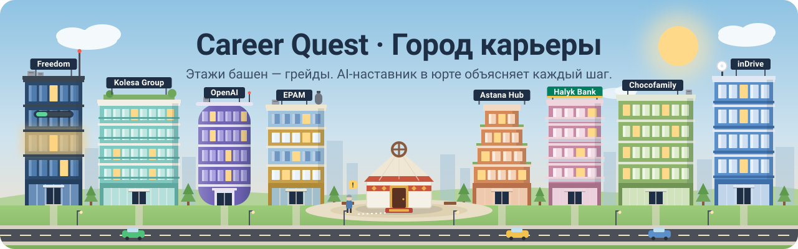

<p align="center">
  
</p>

<p align="center">
  
  
  
  
  
</p>

<h3 align="center">Понятный следующий шаг в карьере — от рекомендации до результата.</h3>

<p align="center">
  <a href="#быстрый-запуск">Запустить</a> ·
  <a href="docs/DEMO.md">Проверить за 5 минут</a> ·
  <a href="docs/REQUIREMENTS.md">Соответствие ТЗ</a> ·
  <a href="docs/ARCHITECTURE.md">Как устроено</a>
</p>

**Career Quest** связывает обучение с карьерной целью сотрудника. Профиль, завершённые активности после ревью, требования следующего грейда и история участия определяют подходящие шаги. Сотрудник видит причины выбора, выполняет практику и получает измеримый прирост навыков. HR изучает разрывы команды и составляет планы обучения.

Интерфейс — **3D-город карьеры**: офисы отделов, площадки обучения, юрта наставника, герой с личным прогрессом. Город помогает исследовать возможности; решение о рекомендации принимает отдельный расчётный движок. Названия компаний на зданиях и в заданиях используются как оформление демонстрационного сценария.

## Для жюри

| Проверка | Где посмотреть |
|---|---|
| Роль, грейд, карьерная цель, навыки и история | Лобби → «Исследовать город» → лист героя **C** |
| До трёх подходящих активностей и причины выбора | «Наставник» → запрос следующего шага; факторы на карточках |
| Изменение навыков после выполнения | «Мой план» **J** / площадка обучения → практика → «Засчитать выполнение» |
| Импорт проверочных профилей и истории | [`/upload`](http://localhost:3000/upload) |
| Компетенции команды и планы обучения | [`/hr`](http://localhost:3000/hr), демо-вход ниже |
| Сравнение карьерных направлений | «Примерить роль» |
| Проверяемый расчёт без LLM и 3D | `GET /api/profile/E0028`, `GET /api/recommend/E0028` |

**[Пошаговый сценарий и ожидаемые результаты →](docs/DEMO.md)**

**[Чек-лист ТЗ с источниками в коде →](docs/REQUIREMENTS.md)**

Статусы в чек-листе отражают реализацию. Основной цикл сотрудника, импорт и обязательные срезы HR реализованы. Сквозное разграничение доступа остаётся частичным. Реальный AI доступен при подключении ключа; без ключа работает явно обозначенный офлайн-режим.

## Быстрый запуск

### Что понадобится

- **Node.js 24** и npm. Документация проверена на Node **24.11.0**, npm **11.6.1**. Минимум Next.js — 20.9, но для TypeScript-практики используется API трансформации типов из более нового Node; для воспроизводимости выбирайте указанную версию.
- Git; Bash и `unzip`, если данные распаковываются скриптом. Для Windows используйте WSL или Git Bash.
- Стартовый архив `career_quest_dataset.zip`, выданный организаторами, либо четыре извлечённых файла из него.
- Браузер с WebGL; основной демонстрационный размер — десктоп **1440 px**.

База данных и ключ LLM для локального запуска не нужны. Python устанавливать не требуется: учебное подмножество языка обрабатывается внутри Node.js. TypeScript/JavaScript-практика также выполняется сервером Node.

### 1. Получить проект

```bash
git clone https://github.com/BAITC-Hacks/hack-88197554-uniqs.git
cd hack-88197554-uniqs
```

### 2. Установить зависимости и запустить одной командой

Замените путь к архиву на свой; кавычки сохраняйте, если в пути есть пробелы:

```bash
npm ci && DATASET_ZIP="/полный/путь/career_quest_dataset.zip" npm run dev -- --port 3000
```

Откройте **[http://localhost:3000](http://localhost:3000)**. При первом запуске Next.js компилирует страницы и браузер загружает модели; дождитесь появления профиля и активной кнопки входа.

`predev` извлекает данные из `case_1/career_quest_dataset/` внутри стартового архива. Если все четыре файла уже есть в `data/`, распаковка пропускается.

<details>
<summary><strong>Данные уже распакованы / повторный запуск</strong></summary>

Разместите файлы непосредственно в корне папки `data/`:

```text
data/
├── employees.json
├── events.json
├── skills.json
└── activity_history.csv
```

Затем:

```bash
npm ci && npm run dev -- --port 3000
```

После установки зависимостей достаточно `npm run dev -- --port 3000`.

`DATASET_ZIP` задавайте в окружении команды: Bash-скрипт `predev` сам не загружает `.env.local`. Автоматический резервный путь `../Варианты/карьера/career_quest_dataset.zip` удобен для рабочей папки команды, но в чистом клоне его может не быть.

</details>

**Почему данных нет в репозитории:** по условиям кейса стартовый набор синтетический и не выносится за пределы хакатона. Жюри использует выданный организаторами архив. Папка `data/` и `.env*` исключены из Git. В репозитории нет реальных персональных данных.

### Production-сборка локально

Предварительно подготовьте `data/` по инструкции выше. В отличие от `npm run dev`, команда `build` архив не распаковывает.

```bash
npm ci
DATASET_ZIP="/полный/путь/career_quest_dataset.zip" bash scripts/setup-data.sh --if-missing
npm run build
npm run start -- --port 3000
```

Перед `start` остановите dev-сервер, использующий тот же порт. Постоянный публичный демостенд в эту поставку не входит.

## Режимы наставника

| Режим | Как включить | Что происходит |
|---|---|---|
| Офлайн | Не задавать ключ либо `LLM_PROVIDER=mock` | Движок рассчитывает кандидатов и факторы, справка и ответ собираются из локальной базы знаний; без вызова модели |
| OpenAI | `OPENAI_API_KEY` и при необходимости `OPENAI_MODEL` | Один вызов модели выбирает/упорядочивает допустимых кандидатов и формулирует ответ |
| Fallback при ошибке API | Автоматически | Ошибка инструмента отображается, остаётся расчётный ответ |

Для онлайн-режима создайте локальный файл `.env.local` и перезапустите сервер:

```dotenv
OPENAI_API_KEY=your_api_key_here
LLM_PROVIDER=openai
# По умолчанию в коде — gpt-6-sol; можно указать доступную вашему аккаунту модель.
OPENAI_MODEL=gpt-6-sol
```

Без явного `LLM_PROVIDER` наличие ключа автоматически выбирает OpenAI. Для воспроизводимой проверки без сети используйте `LLM_PROVIDER=mock`. Ключ нужен только серверу; префикс `NEXT_PUBLIC_` не используется.

Модель не рассчитывает уровни навыков и не добавляет события за пределами подготовленного списка. В запрос уходят карьерные характеристики, навыки, история и сообщения диалога; имя, ID сотрудника и руководитель исключаются из профиля. Онлайн-режим требует доступа к API и подходящей модели. [Подробности и границы AI →](docs/ARCHITECTURE.md#наставник-и-ai)

## Экраны и управление

| Адрес | Назначение |
|---|---|
| `/` | Лобби: сотрудник, герой и цель → город → профиль, наставник, план, практика |
| `/hr` | Компетенции, планы обучения, доступ и роли |
| `/upload` | Импорт `employees.json` и/или `activity_history.csv` для проверки жюри |

Подробные обязательные метрики находятся на вкладке «Обзор компетенций», в раскрываемом блоке **«Подробный HR-отчёт · навыки и участие в обучении»**.

**Демо-доступ HR:** логин **`admin`**, пароль **`admin`** — оба значения латиницей, также указаны на форме входа. Это открытые демонстрационные реквизиты.

| Управление | Действие |
|---|---|
| WASD / стрелки | Передвижение; в первом лице относительно направления взгляда |
| Shift | Бег |
| E / Enter | Войти в здание или взаимодействовать с ближайшим объектом |
| C / J | Лист героя / мой план |
| V | Обзор ↔ вид от первого лица |
| Зажатая мышь и движение | Осмотреться в первом лице |
| Колесо мыши | Приблизить/отдалить в режиме обзора |
| Esc | Закрыть панель, встать или выйти из здания — в зависимости от контекста |
| «Карта» | Быстро перейти к нужному месту |

Панели открываются кнопками, поэтому для проверки бизнес-сценария не нужно вручную обходить весь город. Физические этажи офисов — гостевой, рабочие команды, разработка и управление; карьерный грейд и готовность к нему считаются отдельно в профиле.

## Что сохраняется

| Данные | Хранение и поведение после перезапуска |
|---|---|
| Стартовые профили, события, навыки, история | Читаются из `data/` |
| Импорт, новые выполнения, отказы и карьерные цели | Память одного Node.js-процесса; сбрасываются при его перезапуске |
| HR-аккаунты и планы | Локальный файл `src/features/hr/.local/workspace.json`; нужна записываемая файловая система |
| HR-сессии | Память процесса, срок 8 часов |
| Ник и выбор экипировки | `localStorage` браузера |
| Принятые в городе квесты и черновики практики | Память вкладки; не заменяют серверную историю |

Для повторной проверки импортированных сотрудников после рестарта повторите импорт. HR-планы сохраняются отдельно от профилей, поэтому прежний план может ссылаться на ещё не загруженного сотрудника.

## Проверки и документация

```bash
./scripts/check.sh
```

Команда выполняет генерацию типов маршрутов, TypeScript и ESLint. Предупреждение о `window.location.assign()` на странице импорта известно; ошибок typecheck/lint при подготовке документации нет.

- **[DEMO.md](docs/DEMO.md)** — сценарий жюри, ожидаемые значения, импорт, API-команды и частые проблемы.
- **[REQUIREMENTS.md](docs/REQUIREMENTS.md)** — требования ТЗ, подтверждение в коде и ограничения.
- **[ARCHITECTURE.md](docs/ARCHITECTURE.md)** — архитектура, формула ранжирования, обновление навыков, AI и API.
- [VISION.md](docs/VISION.md) — исходные продуктовые приоритеты; это план, а не подтверждение готовности.
- [DECISIONS.md](docs/DECISIONS.md) — история решений и контрактов; актуальное поведение описано в документах выше.
- [Отдельный прототип офиса](prototypes/office/README.md) — эксперимент с совместным присутствием; основной город не является многопользовательским.

## Границы демо

Роли ограничивают HR-модуль, но публичные API города и импорта остаются демонстрационными. Нет долговременного хранения общего прогресса, автоматического присвоения грейда и подтверждённого замера SLA на хостинге. Эти пункты явно выделены в [чек-листе](docs/REQUIREMENTS.md).

3D-модели KayKit сопровождаются лицензиями в [`public/models/`](public/models/); основной стек — Next.js, React, TypeScript, Tailwind, shadcn/Base UI и React Three Fiber.
