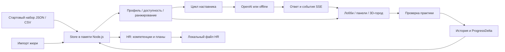

# Архитектура и методология

[← README](../README.md) · [Проверка жюри](DEMO.md) · [Соответствие ТЗ](REQUIREMENTS.md)

## Компоненты

Одно приложение Next.js обслуживает интерфейс и API. React Three Fiber отображает сцену; бизнес-правила находятся в отдельном модуле и доступны без перемещения по городу. Обязательной базы данных нет.



| Модуль | Ответственность |
|---|---|
| [`src/lib/store.ts`](../src/lib/store.ts) | Загрузка JSON/CSV, сотрудники, события, история и изменения в памяти |
| [`src/lib/types.ts`](../src/lib/types.ts) | Форматы датасета и контракты между фичами |
| [`src/features/engine/`](../src/features/engine/) | Эффективные навыки, цель, допустимость, score, прогресс |
| [`src/features/mentor/`](../src/features/mentor/) | Один цикл наставника, сообщения и SSE |
| [`src/features/knowledge/`](../src/features/knowledge/) | Справка продукта, карта возможностей, покрытие разрывов каталогом |
| [`src/lib/llm.ts`](../src/lib/llm.ts) | Выбор провайдера, структурированный ответ модели, таймаут |
| [`src/features/venues/`](../src/features/venues/) | Активности, учебные задания и проверка решения |
| [`src/features/hr/`](../src/features/hr/) | Компетенции, локальные аккаунты, роли, планы и их публикация |
| [`src/features/upload/`](../src/features/upload/) | Проверка и импорт дополнительных профилей/истории |
| [`src/features/career/`](../src/features/career/) | Примерка роли и оценка доступных траекторий |
| [`src/features/character/`](../src/features/character/) | Лист героя, навыки, история, XP и экипировка |
| [`src/features/city/`](../src/features/city/) | Геометрия города/интерьеров, движение, камера, объекты взаимодействия |
| [`src/features/hud/`](../src/features/hud/) | Лобби, навигация, карта, следующий шаг |
| [`src/app/api/`](../src/app/api/) | Тонкие обработчики маршрутов, вызывающие модули фич |

Клиентское состояние — `useSyncExternalStore`; положение персонажа обновляется на каждом кадре отдельно от React. Серверный store — singleton в `globalThis`, переживает HMR, но не перезапуск процесса. Для этой версии нужен один серверный процесс с общим состоянием.

## Расчёт профиля

1. Найти сотрудника и определить цель: `career_goal`, иначе следующий грейд своей роли. Для Lead без цели вернуть `target=null`.
2. Начать с `employee.skills` на дату `last_review_date`.
3. В хронологическом порядке применить completed **после ревью** и не позже фиксированной даты **2026-10-01**. Для каждого развиваемого навыка:

   ```text
   next = max(current, min(current + gain, max_level))
   ```

4. Сопоставить эффективные уровни с `role_profiles.required_skills`. `critical_skills` отмечают особенно важные требования.
5. Рассчитать `gradeProgress`: количество достигнутых требований и их общее число; отдельно — количество критических требований. Это не средний балл и не сумма уровней.

Начальный snapshot не переписывается после выполнения: новая история снова применяется при следующем расчёте. Так completed после ревью не теряются и не начисляются дважды из-за мутации snapshot.

## Отбор и ранжирование

До score исключаются mandatory, уже завершённые события, неподходящие текущие роль/грейд, непройденные prerequisites, недоступные сессии и активности без полезного прироста к цели. Для регулярного клуба EV_036 разрешается другой день участия.

Для каждого навыка события:

```text
gap    = max(0, required − current)
closed = max(0, min(current + gain, max_level, required) − current)

skillScore = closed × (critical ? 4 : 2)
           + gap    × (critical ? 1 : 0.5)
```

Учитываются только навыки с полезным `closed > 0`. К сумме добавляются две независимые оценки добровольной истории — по **типу** и по **формату**:

```text
historyScore = clamp(0.5 × completed − no_show − dropped − declined, −3, 1.5)
score = sum(skillScore) + historyScore(type) + historyScore(format)
```

Кандидаты сортируются по score по убыванию, затем по `event_id`; выбираются первые три. Отрицательный score не отсекается автоматически. Поэтому неподходящий по prerequisites курс исключён, а курс с плохой историей формата лишь теряет приоритет.

Карточка хранит факторы разрыва/критичности, цели, истории, даты и prerequisites; при наличии истории формата добавляется отдельный фактор. Цель, prerequisites и дата могут иметь нулевой вклад в числовой score: они объясняют допустимость и связь с траекторией. Стаж, язык, формат работы и оценки обратной связи не входят в этот детерминированный score.

## Наставник и AI

Последовательность задаётся кодом: **get_profile → read_ecosystem_knowledge → recommend → один вызов career_ai при онлайн-режиме → проверка ответа → final**. Это фиксированный цикл; выбор инструментов не поручен автономному планировщику.

- `/api/recommend/[id]` всегда отдаёт расчётный список без LLM.
- `/api/mentor` передаёт события `thought`, `tool_call`, `tool_result`, `tool_error`, `final` через SSE.
- Во время диалога видна текущая стадия. После ответа раскрывается «Как получен ответ»; компактная панель следующего шага также показывает вызовы по мере получения.
- OpenAI получает только допустимый top-3, карьерные характеристики, добровольную историю, контекст базы знаний и до 12 сообщений диалога. Исходные имя, ID сотрудника и руководителя исключены из структурированного контекста; текст чата передаётся как есть.
- Модель может выбрать 0–3 кандидата, поменять их порядок, сформулировать объяснение или уточняющий вопрос. Неизвестный `eventId` отклоняет весь ответ AI и включает fallback; дубли карточек убираются. Модель не меняет score, факторы, `gain` и требования грейда.
- Формат ответа ограничен JSON schema. Требование опираться минимум на три фактора в самой прозе задаётся инструкцией; семантического валидатора текста нет. Расчётные факторы остаются на карточках.
- Запрос использует Responses API, `store=false`, таймаут **8500 мс**, без повторных попыток. При ошибке приходит `tool_error` и расчётный fallback. Это не гарантия задержки всего пользовательского сценария.
- База знаний собирает справку продукта, источники, карту экосистемы и покрытие разрывов каталогом; используется и онлайн, и без сети. Она не подключает реальные вакансии или проекты компаний.
- Офлайн-режим использует базу знаний, шаблоны и правила по сообщению (например, формат/длительность); он явно отделён от онлайн-AI.

`OPENAI_API_KEY`, `OPENAI_MODEL` и `LLM_PROVIDER` настраиваются только на сервере. Выбор провайдера и значение модели по умолчанию описаны в [README](../README.md#режимы-наставника).

## Выполнение и прогресс

`POST /api/progress` записывает completed или declined на расчётную дату. Completed обычного события повторно не засчитывается; EV_036 — не более одного раза за этот день. Повтор declined в тот же день также не создаёт дополнительную запись.

Completed пересчитывает навыки по всем `develops_skills` до `max_level`, в том числе по навыкам вне текущей цели. Declined не даёт прироста, но влияет на следующую оценку истории. Обязательные события не получают игровых наград; при этом их фактическая история может участвовать в расчёте навыков согласно данным.

UI получает `ProgressDelta`: уровни до/после, изменение количества закрытых требований и `gradeReady`. Сам грейд сотрудника автоматически не меняется. Клиент обновляет профиль и убирает завершённую карточку; полный новый подбор выполняется следующим запросом к наставнику.

Практические задания — демонстрационные. Банк содержит 36 тематических заданий для EV_005…EV_040: 3 Python, 7 TypeScript и 26 кейсов по три вопроса. Для незнакомого/переименованного события используется общий кейс по типу активности.

- Python исполняется ограниченным интерпретатором внутри TypeScript: без `eval`, запуска shell, доступа к файлам и отдельного Python-runtime.
- TypeScript/JavaScript использует встроенную трансформацию типов Node и новый `node:vm`-контекст для каждой проверки; таймаут 200 мс на проверку, без импортов и асинхронного кода. Для воспроизводимости нужен Node 24. Это демонстрационный runner, а не изолированная ОС-песочница для произвольного кода.
- Кодовая задача содержит 5–6 проверок. Ошибки показывают фактический и ожидаемый результаты; это учебная обратная связь.
- «Засчитать выполнение» повторно проверяет отправленное решение на сервере. Оценка успешного решения: `max(50, 100 − 10 × max(0, attempts − 1) − 10 × hints)`. Засчитывание уже проверенного решения не добавляет попытку.
- Оценка записывается в новую историю completed; подсказки не уменьшают `gain`. Оценка может влиять на бонус XP, но не входит в текущий рекомендательный score. Счётчики попыток хранятся в памяти, число использованных подсказок приходит с клиента — это не защищённый экзамен.

## API

| Метод и маршрут | Вход / результат |
|---|---|
| `GET /api/employees` | Список профилей |
| `GET /api/events` | Каталог активностей |
| `GET /api/knowledge?employeeId=E0028&q=...` | Справка, источники и персональные пробелы каталога |
| `GET /api/profile/[id]` | Эффективные навыки, цель, разрывы, история и прогресс |
| `GET /api/recommend/[id]` | Детерминированные рекомендации с факторами |
| `POST /api/mentor` | `{employeeId, messages?}` → SSE; также поддерживает исключённые карточки |
| `POST /api/progress` | `{employeeId, eventId, status}` → `ProgressDelta` |
| `GET /api/goal`, `POST /api/goal` | Доступные цели / выбор карьерной цели; точный контракт в [engine/goal.ts](../src/features/engine/goal.ts) |
| `GET /api/career/preview` | Сравнение карьерных траекторий; параметры в [career/api.ts](../src/features/career/api.ts) |
| `GET /api/venues/practice?eventIds=EV_012,EV_013` | Условия, starter, подсказки и примеры выбранных задач без эталонного решения |
| `POST /api/venues/practice` | `{employeeId, eventId, code?, answers?, hints?, complete}` → проверки, score и при засчитывании delta |
| `POST /api/upload` | Multipart с профилями/историей → число импортированных записей |
| `/api/hr`, `/api/hr/session`, `/api/hr/access`, `/api/hr/candidates`, `/api/hr/plans` | HR-сессия, компетенции, доступ и планы; маршруты требуют проверки роли по действию |

Форматы данных — в [`types.ts`](../src/lib/types.ts); параметры импорта — в [`fields.ts`](../src/features/upload/fields.ts). Для progress: некорректный запрос — 400, неизвестный сотрудник/событие — 404, недоступное действие — 409.

## Хранение, роли и ограничения

HR-аккаунты и планы записываются в `src/features/hr/.local/workspace.json`. HR-сессии — в памяти, на 8 часов; cookie ограничена `/api/hr`, HttpOnly и SameSite Strict. Admin имеет полный доступ внутри этого модуля; HR/manager ограничены назначенными отделами и разрешениями; employee видит свой профиль и опубликованные планы.

Это разграничение **не распространяется на публичные API города и импорта**. Основной store не сохраняет прогресс, цели и импорт после перезапуска, а несколько экземпляров сервера не синхронизируют состояние. Раздельное хранение HR-планов и импортированных профилей также требует повторного импорта после рестарта.

[`hr/summary.ts`](../src/features/hr/summary.ts) рассчитывает слабые навыки, `noStep` и participation для доступного среза сотрудников. `/api/hr` возвращает этот отчёт; [`HistoricalReport.tsx`](../src/features/hr/HistoricalReport.tsx) показывает его в раскрываемом блоке обзора компетенций. «Нужен план обучения» и «Нет рекомендованного шага» — разные метрики. Полная матрица требований — [REQUIREMENTS.md](REQUIREMENTS.md).
